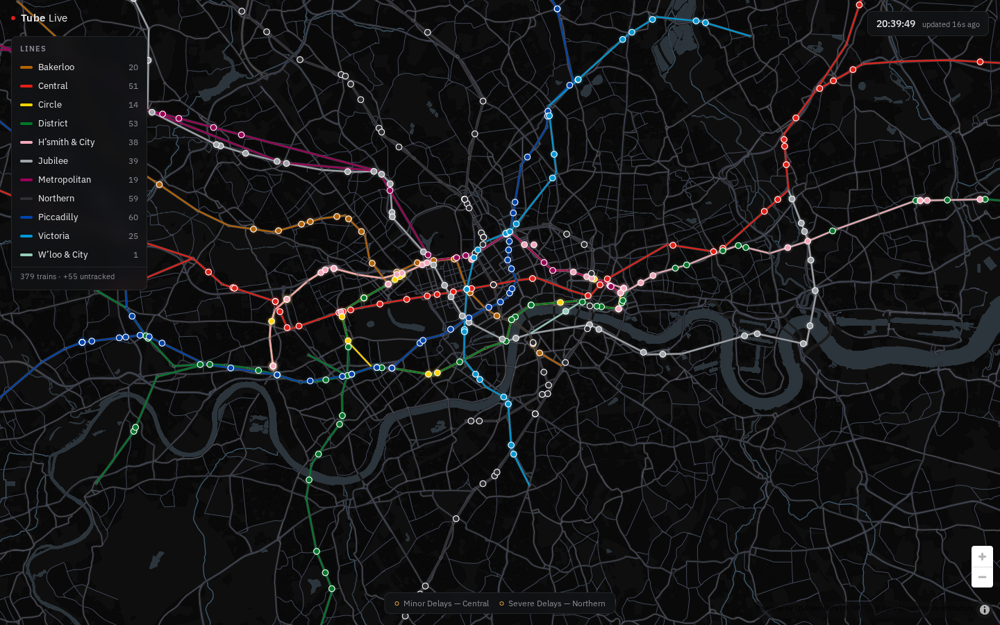

# Tube Live

A live map of the London Underground — every train in service, moving along its
line in near real time. Flightradar, but for the tube.



## How it works

TfL publishes no GPS feed for trains, so positions are *inferred*:

1. Every ~27 seconds the app polls the
   [TfL Unified API](https://api.tfl.gov.uk) arrivals endpoint for all eleven
   lines in one batched request. Each prediction carries a `vehicleId`, the
   next station, seconds-to-arrival, and a human-readable location
   ("Between Pimlico and Victoria", "Left Euston", "At Platform").
2. An estimator places each train on a station-to-station segment of its
   route: the location text and branch topology pick the segment (Northern
   via Bank vs Charing Cross, Circle loop, Metropolitan forks), and
   seconds-to-arrival against an estimated segment travel time gives the
   position along it.
3. Between polls a `requestAnimationFrame` loop dead-reckons each train
   forward and eases corrections in smoothly, so the motion is continuous
   rather than a 27-second slideshow.

Route geometry, station names and branch structure come from the same API at
startup (cached in `localStorage` for a week). The basemap is CARTO Dark
Matter rendered with MapLibre GL JS. There is no backend: the browser talks
to TfL directly.

## Develop

```sh
npm install
npm run dev     # local dev server
npm test        # unit tests (location parser, position estimator)
npm run build   # typecheck + production bundle in dist/
```

Optionally set `VITE_TFL_APP_KEY` with a [TfL API key](https://api-portal.tfl.gov.uk/)
to raise rate limits; anonymous access is fine for a single client.

Deployed to GitHub Pages by `.github/workflows/deploy.yml` on every push to
`main`.

Powered by TfL Open Data. Contains OS data © Crown copyright and database
rights 2016 and Geomni UK Map data © and database rights 2019.
